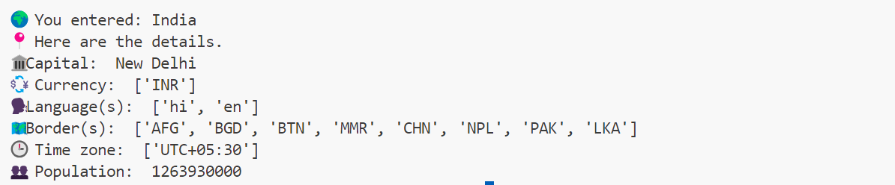

🌐 Country Info Finder 🗺️ | Python 🐍
=========================================
"A Python script that fetches in-depth country information using the countryinfo package."

📌 Features
=============================
- Get the **Capital**
- Know the **Currency**
- See the **Languages**
- Find **Border countries**
- View **Time zones**
- Get **Population data**

🚀 How to Run | 🐍
================================
1. Install the required package:

 pip install country info

💡 Example Output
================================

